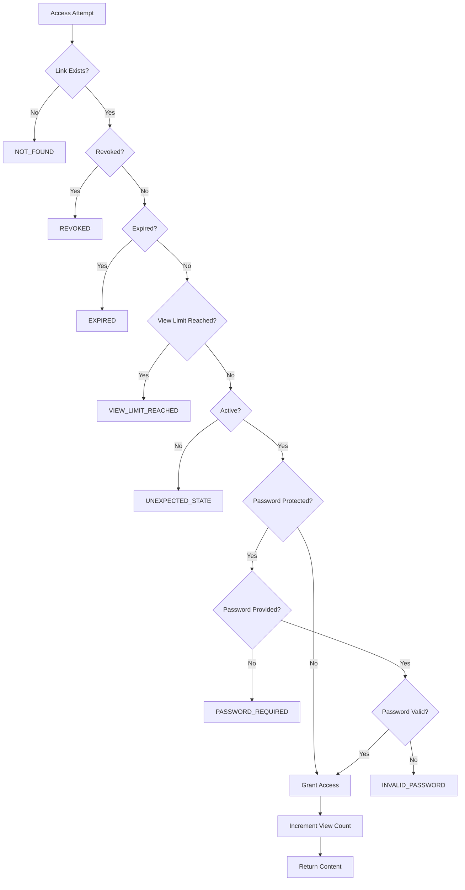

## Overview

Secure Link API implements a multi-layered access control system that validates every link access attempt against configured security constraints. Access is granted only when all validation checks pass.

## Security Constraints

Each secure link can be protected by three independent security mechanisms:

<CardGroup cols={3}>

<Card title="Time Expiration" icon="clock">
Links automatically expire at a specified timestamp
</Card>

<Card title="View Limits" icon="eye">
Links expire after being accessed a maximum number of times
</Card>

<Card title="Password Protection" icon="lock">
Links require password authentication before access
</Card>

</CardGroup>

## Time-Based Expiration

### Configuration

Links can be configured with an `expiresAt` timestamp:

```json Request Example
{
  "targetUrl": "https://example.com/resource",
  "expiresAt": "2024-12-31T23:59:59Z",
  "maxViews": null,
  "password": null
}
```

### Validation Logic

The system checks expiration using timezone-aware comparison:

```java SecureLink.java:94-104
public boolean isExpired() {
  if (expiresAt == null) {
    return false;  // No expiration set
  }
  boolean expired = OffsetDateTime.now(expiresAt.getOffset()).isAfter(expiresAt);
  if (expired) {
    expire();  // Transition to EXPIRED status
  }
  return expired;
}
```

<Warning>
Expiration checks use the **same timezone offset** as the stored `expiresAt` value to ensure accurate comparison across timezones.
</Warning>

### Default TTL

If no `expiresAt` is provided, the system applies a default TTL configured in `LinkTtlProperties`:

```java CreateLinkServiceImpl.java:71-75
private OffsetDateTime resolveExpiresAt(OffsetDateTime requestedExpiresAt) {
  return requestedExpiresAt != null
    ? requestedExpiresAt
    : OffsetDateTime.now().plus(linkTtlProperties.getDefaultTtl());
}
```

## View Limit Controls

### Configuration

The `maxViews` parameter limits how many times a link can be successfully accessed:

```json Request Example
{
  "targetUrl": "https://example.com/resource",
  "expiresAt": null,
  "maxViews": 5,
  "password": null
}
```

### Tracking and Enforcement

Each successful access increments the `viewCount`, and the link expires when the limit is reached:

```java SecureLink.java:79-88
public boolean hasReachedViewLimit() {
  return maxViews != null && viewCount >= maxViews;
}

public void incrementViewCount() {
  this.viewCount++;
  if (hasReachedViewLimit()) {
    expire();  // Auto-expire on limit
  }
}
```

<Info>
**Only successful access attempts** count toward `maxViews`. Failed attempts (wrong password, etc.) do not increment the counter.
</Info>

### Validation During Resolution

The resolver checks view limits **before** granting access:

```java ResolveLinkServiceImpl.java:78-82
if (link.hasReachedViewLimit()) {
  link.expire();
  repository.save(link);
  handleDenied(link.getShortCode(), AccessResult.VIEW_LIMIT_REACHED, "view_limit_reached", context);
}
```

## Password Protection

### Setting a Password

Passwords are hashed using BCrypt before storage:

```java CreateLinkServiceImpl.java:46-49
if (request.password() != null && !request.password().isBlank()) {
  String hash = passwordEncoder.encode(request.password());
  link.protectWithPassword(hash);
}
```

```java SecureLink.java:118-121
public void protectWithPassword(String passwordHash) {
  this.passwordHash = passwordHash;
  this.passwordProtected = true;
}
```

<Warning>
**Never** store passwords in plaintext. The system uses `PasswordEncoder` (BCrypt) for secure hashing.
</Warning>

### Password Validation

When accessing a password-protected link:

1. Client must provide password via query parameter or header
2. System checks if password is required
3. System validates password against stored hash

```java ResolveLinkServiceImpl.java:87-94
if (link.isPasswordProtected()) {
  if (password == null || password.isBlank()) {
    handleDenied(link.getShortCode(), AccessResult.PASSWORD_REQUIRED, 
      "password_required", HttpStatus.UNAUTHORIZED, "Password required", context);
  }
  if (!passwordEncoder.matches(password, link.getPasswordHash())) {
    handleDenied(link.getShortCode(), AccessResult.INVALID_PASSWORD, 
      "invalid_password", HttpStatus.UNAUTHORIZED, "Invalid password", context);
  }
}
```

### Access Patterns

<Tabs>
  <Tab title="Without Password">
    ```bash
    GET /l/{shortCode}
    ```
    
    Returns HTTP 200 with content or redirect.
  </Tab>
  
  <Tab title="With Password">
    ```bash
    GET /l/{shortCode}?password=secret123
    ```
    
    Password is validated before granting access.
  </Tab>
  
  <Tab title="Missing Password">
    ```bash
    GET /l/{shortCode}
    # For password-protected link
    ```
    
    Returns HTTP 401 Unauthorized with `PASSWORD_REQUIRED` result.
  </Tab>
  
  <Tab title="Wrong Password">
    ```bash
    GET /l/{shortCode}?password=wrongpass
    ```
    
    Returns HTTP 401 Unauthorized with `INVALID_PASSWORD` result.
  </Tab>
</Tabs>

## Validation Flow

Every access attempt goes through a comprehensive validation pipeline in `ResolveLinkServiceImpl`:



### Implementation

The complete validation sequence from `ResolveLinkServiceImpl.java:46-126`:

```java
@Transactional
public ResolveResultDto resolve(String shortCode, String password, AccessContextDto context) {
  
  // Step 1: Link existence check
  SecureLink link = repository.findByShortCode(shortCode)
    .orElseThrow(() -> {
      auditService.audit(shortCode, AccessResult.NOT_FOUND, context.ipAddress(), context.userAgent());
      throw new ResponseStatusException(HttpStatus.NOT_FOUND, "Link not found");
    });
  
  // Step 2: Revocation check
  if (link.isRevoked()) {
    handleDenied(link.getShortCode(), AccessResult.REVOKED, "revoked", context);
  }
  
  // Step 3: Time expiration check
  if (link.isExpired()) {
    repository.save(link);  // Persist status change
    handleDenied(link.getShortCode(), AccessResult.EXPIRED, "expired", context);
  }
  
  // Step 4: View limit check
  if (link.hasReachedViewLimit()) {
    link.expire();
    repository.save(link);
    handleDenied(link.getShortCode(), AccessResult.VIEW_LIMIT_REACHED, "view_limit_reached", context);
  }
  
  // Step 5: Status validation
  if (!link.isActive()) {
    handleDenied(link.getShortCode(), AccessResult.UNEXPECTED_STATE, "inactive", context);
  }
  
  // Step 6: Password validation
  if (link.isPasswordProtected()) {
    if (password == null || password.isBlank()) {
      handleDenied(link.getShortCode(), AccessResult.PASSWORD_REQUIRED, 
        "password_required", HttpStatus.UNAUTHORIZED, "Password required", context);
    }
    if (!passwordEncoder.matches(password, link.getPasswordHash())) {
      handleDenied(link.getShortCode(), AccessResult.INVALID_PASSWORD, 
        "invalid_password", HttpStatus.UNAUTHORIZED, "Invalid password", context);
    }
  }
  
  // Step 7: Grant access
  link.incrementViewCount();
  repository.save(link);
  auditService.audit(shortCode, AccessResult.SUCCESS, context.ipAddress(), context.userAgent());
  
  // Step 8: Return content based on link type
  if (link.getTargetUrl() != null && !link.getTargetUrl().isBlank()) {
    return new ResolveResultDto(LinkType.REDIRECT, link.getTargetUrl(), null, null);
  }
  
  Resource fileUri = fileUtils.getResource(link.getFilePath());
  return new ResolveResultDto(LinkType.DOWNLOAD, null, fileUri, link.getOriginalFileName());
}
```

<Note>
**Validation order matters.** Checks are performed in a specific sequence to provide the most accurate denial reason.
</Note>

## HTTP Response Codes

Different validation failures return specific HTTP status codes:

| Validation Failure | HTTP Status | AccessResult |
|-------------------|-------------|-------------|
| Link not found | 404 Not Found | `NOT_FOUND` |
| Password required | 401 Unauthorized | `PASSWORD_REQUIRED` |
| Invalid password | 401 Unauthorized | `INVALID_PASSWORD` |
| Link revoked | 410 Gone | `REVOKED` |
| Link expired (time) | 410 Gone | `EXPIRED` |
| View limit reached | 410 Gone | `VIEW_LIMIT_REACHED` |
| Unexpected state | 410 Gone | `UNEXPECTED_STATE` |
| Success | 200 OK / 302 Found | `SUCCESS` |

## Combining Constraints

Multiple security constraints can be combined for enhanced protection:

```json Multi-Layer Security Example
{
  "targetUrl": "https://example.com/sensitive-resource",
  "expiresAt": "2024-12-31T23:59:59Z",
  "maxViews": 10,
  "password": "secure-pass-123"
}
```

This link:
- Expires on December 31, 2024
- Can be accessed maximum 10 times
- Requires password authentication
- Expires when **any** constraint is violated

<Tip>
For highly sensitive content, use **all three constraints** to create defense-in-depth security.
</Tip>

## Next Steps

<CardGroup cols={2}>

<Card title="Audit Tracking" icon="list-check" href="/concepts/audit-tracking">
Learn how access attempts and validation results are logged
</Card>

<Card title="API Reference" icon="code" href="/api/links/resolve">
See the complete API documentation for link resolution
</Card>

</CardGroup>