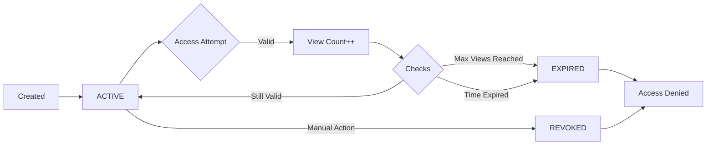

## What are Secure Links?

Secure Links are time-limited, access-controlled URLs that provide secure sharing of content. Each link is identified by a unique `shortCode` and can be configured with various security constraints including expiration times, view limits, and password protection.

## Link Types

The system supports two distinct link types, defined in the `LinkType` enum:

<CodeGroup>

```java LinkType.java
package br.com.walyson.secure_link.domain.enums;

public enum LinkType {
  REDIRECT,
  DOWNLOAD
}
```

</CodeGroup>

### REDIRECT Links

Redirect links forward users to a target URL after validation. These are created via the `/api/links` endpoint.

<Card title="Use Cases" icon="arrow-right">
- Sharing external resources with access controls
- Creating temporary marketing campaign URLs
- Distributing time-sensitive partner links
</Card>

**Example:**
```java
SecureLink link = new SecureLink(
  shortCode,
  "https://example.com/resource",  // targetUrl
  expiresAt,
  maxViews
);
```

### DOWNLOAD Links

Download links serve files from server storage. These are created via the `/api/links/upload` endpoint with file upload.

<Card title="Use Cases" icon="download">
- Sharing confidential documents securely
- Distributing time-limited software releases
- Temporary file sharing with clients
</Card>

**Example:**
```java
SecureLink link = new SecureLink(
  shortCode,
  filePath,             // Path to stored file
  originalFileName,     // Original filename for download
  expiresAt,
  maxViews
);
```

## Link Lifecycle

Every secure link progresses through a defined lifecycle from creation to eventual expiration or revocation.



### Creation

When a link is created:
1. A unique `shortCode` is generated (see `CodeUtils.java:23`)
2. Initial status is set to `ACTIVE`
3. `viewCount` is initialized to `0`
4. Optional security constraints are applied (password, expiration, max views)

### Active Usage

While `ACTIVE`, the link:
- Accepts access requests that pass validation
- Increments `viewCount` on each successful access
- Validates security constraints before granting access

### Expiration

A link automatically expires when:
- Current time exceeds `expiresAt` timestamp
- `viewCount` reaches `maxViews` limit

```java SecureLink.java:79-88
public boolean hasReachedViewLimit() {
  return maxViews != null && viewCount >= maxViews;
}

public void incrementViewCount() {
  this.viewCount++;
  if (hasReachedViewLimit()) {
    expire();
  }
}
```

### Revocation

Links can be manually revoked via the `/api/links/{shortCode}/revoke` endpoint, immediately denying all access.

## Link Status States

The `LinkStatus` enum defines three possible states:

<CodeGroup>

```java LinkStatus.java
package br.com.walyson.secure_link.domain.enums;

public enum LinkStatus {
  ACTIVE,
  EXPIRED,
  REVOKED
}
```

</CodeGroup>

<AccordionGroup>

<Accordion title="ACTIVE" icon="check-circle">
The link is operational and accepts access requests. All new links start in this state.

**Characteristics:**
- Accepts access attempts
- Validates against security constraints
- Increments view count on successful access
</Accordion>

<Accordion title="EXPIRED" icon="clock">
The link has reached its expiration condition and denies all access.

**Triggers:**
- Current time exceeds `expiresAt`
- View count reaches `maxViews`

**Behavior:**
- Returns `AccessResult.EXPIRED` or `AccessResult.VIEW_LIMIT_REACHED`
- HTTP 410 Gone status
- Access attempt is logged in audit trail
</Accordion>

<Accordion title="REVOKED" icon="ban">
The link has been manually disabled by an administrator.

**Characteristics:**
- Permanent state (cannot be reversed)
- Returns `AccessResult.REVOKED`
- HTTP 410 Gone status
- All access attempts logged
</Accordion>

</AccordionGroup>

## Domain Model

The `SecureLink` entity contains all link metadata:

```java SecureLink.java:23-127
@Entity
@Table(name = "secure_link")
public class SecureLink {
  
  @Id
  @GeneratedValue(strategy = GenerationType.UUID)
  private UUID id;
  
  @Column(name = "short_code", nullable = false, unique = true, length = 20)
  private String shortCode;
  
  @Column(name = "file_path", length = 500)
  private String filePath;
  
  @Column(name = "original_file_name")
  private String originalFileName;
  
  @Column(name = "target_url", length = 500)
  private String targetUrl;
  
  @Column(name = "expires_at")
  private OffsetDateTime expiresAt;
  
  @Column(name = "max_views")
  private Integer maxViews;
  
  @Column(name = "view_count", nullable = false)
  private Integer viewCount = 0;
  
  @Enumerated(EnumType.STRING)
  @Column(nullable = false)
  private LinkStatus status = LinkStatus.ACTIVE;
  
  @Column(name = "password_hash")
  private String passwordHash;
  
  @Column(name = "password_protected", nullable = false)
  private boolean passwordProtected;
  
  @Column(name = "created_at", nullable = false)
  private OffsetDateTime createdAt = OffsetDateTime.now();
}
```

<Note>
Either `targetUrl` (REDIRECT) or `filePath` (DOWNLOAD) must be set, but never both.
</Note>

## Key Methods

### Status Checking

```java
public boolean isActive() {
  return this.status == LinkStatus.ACTIVE;
}

public boolean isExpired() {
  if (expiresAt == null) {
    return false;
  }
  boolean expired = OffsetDateTime.now(expiresAt.getOffset()).isAfter(expiresAt);
  if (expired) {
    expire();
  }
  return expired;
}

public boolean isRevoked() {
  return this.status == LinkStatus.REVOKED;
}
```

### Status Transitions

```java
public void expire() {
  this.status = LinkStatus.EXPIRED;
}

public void revoke() {
  this.status = LinkStatus.REVOKED;
}
```

<Info>
Status transitions are **one-way**. Once a link is EXPIRED or REVOKED, it cannot return to ACTIVE.
</Info>

## Next Steps

<CardGroup cols={2}>

<Card title="Access Control" icon="shield-halved" href="/concepts/access-control">
Learn about expiration rules, view limits, and password protection
</Card>

<Card title="Audit Tracking" icon="list-check" href="/concepts/audit-tracking">
Understand how access attempts are logged and monitored
</Card>

</CardGroup>